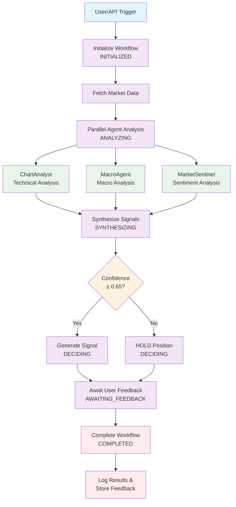

# ApexAI Aura Insight

**High-quality, synthesized day trading signals through AI orchestration**

ApexAI Aura Insight is a sophisticated trading signal generation platform that orchestrates multiple specialized AI agents to provide transparent, actionable trading insights. The platform prioritizes user trust and transparency over automated execution.

## 🌟 Features

- **Multi-Agent Orchestration**: Coordinates ChartAnalyst, MacroAgent, and MarketSentinel agents
- **Advanced Signal Synthesis**: Sophisticated confidence scoring and risk assessment
- **Real-time Market Data**: Integration with multiple data sources (Yahoo Finance, Alpha Vantage, Polygon, Finnhub)
- **LangGraph Workflow**: Stateful workflow management with human-in-the-loop feedback
- **Comprehensive Analysis**: Technical, macro, and sentiment analysis combined
- **Risk Management**: Built-in risk assessment and position sizing recommendations

## 🏗️ Architecture

### Core Agents

1. **ChartAnalyst**: Technical analysis expert
   - Pivot point detection
   - AB-CD pattern recognition
   - Fibonacci retracement/extension analysis
   - Support/resistance level identification

2. **MacroAgent**: Economic analysis specialist
   - Economic calendar monitoring
   - Central bank policy analysis
   - Geopolitical risk assessment
   - Macroeconomic indicator tracking

3. **MarketSentinel**: Sentiment and flow analyst
   - Social media sentiment analysis
   - News sentiment monitoring
   - Volume pattern analysis
   - Unusual activity detection

4. **PlatformPilot**: Master orchestrator
   - Agent coordination
   - Signal synthesis
   - Confidence scoring
   - Final decision making

### Workflow States

```
INITIALIZED → ANALYZING → SYNTHESIZING → DECIDING → AWAITING_FEEDBACK → COMPLETED
```

## 🚀 Quick Start

### Prerequisites

- Python 3.8+
- API keys for at least one LLM provider (Gemini, Moonshot, or Mistral)
- Optional: Market data API keys (Alpha Vantage, Polygon, Finnhub)

### Installation

1. Clone the repository:
```bash
git clone <repository-url>
cd apexai-standalone/app
```

2. Install dependencies:
```bash
pip install -r requirements.txt
```

3. Set up environment variables:
```bash
cp .env.example .env
# Edit .env with your API keys
```

4. Run the platform:
```bash
# Option 1: Command-line interface
python main.py

# Option 2: Web API with dashboards (recommended)
python run_api.py
```

### Environment Variables

```env
# Required: At least one LLM API key
GEMINI_API_KEY=your_gemini_key
MOONSHOT_API_KEY=your_moonshot_key
MISTRAL_API_KEY=your_mistral_key

# Optional: Market data APIs
ALPHA_VANTAGE_API_KEY=your_alpha_vantage_key
POLYGON_API_KEY=your_polygon_key
FINNHUB_API_KEY=your_finnhub_key
NEWS_API_KEY=your_news_api_key
```

## 🌐 Web Dashboards

ApexAI Aura Insight now includes modern web dashboards for enhanced user experience:

### Trading Dashboard (`/dashboard`)
- **Real-time Signal Generation**: Generate signals for individual symbols or watchlists
- **Live Signal Display**: View active trading signals with detailed analysis
- **WebSocket Updates**: Real-time updates via WebSocket connection
- **User Feedback**: Provide feedback on signals for continuous improvement
- **System Monitoring**: View platform status and activity logs

### Observability Dashboard (`/observability`)
- **System Health**: Monitor platform status, active workflows, and uptime
- **Feedback Analytics**: Track user feedback and signal accuracy metrics
- **Agent Performance**: Visualize individual agent contribution and performance
- **Recent Activity**: View recent feedback and system activity
- **Real-time Logs**: Monitor system logs and error tracking

### API Endpoints
- **REST API**: Full REST API for signal generation and feedback
- **WebSocket**: Real-time signal broadcasting
- **Interactive Docs**: Auto-generated API documentation at `/docs`

## 📊 Usage

### Interactive Menu

The platform provides an interactive menu with the following options:

1. **Generate signal for single symbol**: Analyze a specific stock/ETF
2. **Run signals for watchlist**: Analyze multiple symbols
3. **Run continuous monitoring**: Monitor watchlist continuously
4. **View platform status**: Check system status
5. **Exit**: Close the application

### Example Usage

#### Command Line Interface
```python
# Generate signal for SPY
python main.py
# Select option 1
# Enter symbol: SPY

# Run watchlist analysis
python main.py
# Select option 2
# Analyzes: ZAR=X, SI=F, GC=F
```

#### Web Dashboards
```bash
# Start the API server
python run_api.py

# Then open in browser:
# Trading Dashboard: http://localhost:8000/dashboard
# Observability Dashboard: http://localhost:8000/observability
# API Documentation: http://localhost:8000/docs
```

## 🔧 Configuration

### Watchlist

Default watchlist in `main.py`:
```python
self.watchlist = ["ZAR=X", "SI=F", "GC=F"]
```

### Agent Weights

Configure agent importance in `signal_synthesis.py`:
```python
self.base_agent_weights = {
    "chartanalyst": 0.4,    # Technical analysis
    "macroagent": 0.3,      # Macro analysis
    "marketsentinel": 0.3   # Sentiment analysis
}
```

### Confidence Thresholds

Adjust signal generation thresholds:
```python
self.confidence_thresholds = {
    "strong_signal": 0.75,
    "moderate_signal": 0.65,
    "weak_signal": 0.55,
    "hold_threshold": 0.65
}
```

## 📈 Signal Output Format

```json
{
  "asset": "SPY",
  "direction": "LONG",
  "confidence": 0.78,
  "entry_target": 451.00,
  "stop_loss_target": 450.25,
  "take_profit_target": 452.50,
  "risk_reward_ratio": 2.0,
  "signal_strength": "MODERATE",
  "agent_consensus": {
    "chartanalyst": "BUY",
    "macroagent": "BUY",
    "marketsentinel": "HOLD"
  },
  "confirming_factors": [
    "Strong bullish pattern",
    "Positive macro outlook"
  ],
  "conflicting_factors": [
    "Mixed sentiment signals"
  ],
  "risk_assessment": {
    "market_risk": "MEDIUM",
    "volatility_risk": "LOW",
    "liquidity_risk": "LOW"
  },
  "reasoning": "Bullish consensus with 2/3 agents recommending LONG positions. Overall confidence score of 0.78",
  "recommendations": [
    "Consider taking position with reduced allocation",
    "Monitor position closely and adjust stop loss as needed"
  ],
  "next_review_time": "Within 4 hours"
}
```

## 🧪 Testing

### Individual Agent Testing

```bash
# Test ChartAnalyst
python chartanalyst.py

# Test MacroAgent
python macroagent.py

# Test MarketSentinel
python marketsentinel.py

# Test PlatformPilot
python platformpilot.py
```

### Integration Testing

```bash
# Test complete workflow
python trading_graph.py

# Test market data fetching
python market_data_fetcher.py
```

## 📁 Project Structure

```
app/
├── main.py                 # Main entry point
├── trading_graph.py        # LangGraph workflow orchestration
├── trading_state.py        # State management
├── signal_synthesis.py     # Advanced signal synthesis
├── market_data_fetcher.py  # Market data integration
├── chartanalyst.py         # Technical analysis agent
├── macroagent.py           # Macro analysis agent
├── marketsentinel.py       # Sentiment analysis agent
├── platformpilot.py        # Master orchestrator
├── model.py               # LLM initialization
├── fetchers/              # Data fetching utilities
│   ├── yfin.py
│   ├── alpha.py
│   └── yfin_candles.py
└── tools/                 # Utility tools
    ├── webtools.py
    └── helper.py
```

## 📜 Scripts Overview

This section provides a comprehensive overview of all valid and actively used scripts in the ApexAI project.

### 🎯 Primary Entry Points

#### **`main.py`** - Main Application Entry Point
- **Purpose**: Interactive platform for ApexAI Aura Insight
- **Usage**: `python main.py`
- **Features**: Interactive menu for signal generation, watchlist analysis, continuous monitoring
- **Status**: ✅ **ACTIVE** - Primary application users should run

#### **`app.py`** - Alternative Macro Analysis Tool
- **Purpose**: Standalone macro market analysis with Gemini AI
- **Usage**: `python app.py`
- **Features**: Macro forecaster and market sentinel agents for Gold, Silver, USD/ZAR
- **Status**: ✅ **ACTIVE** - Functional standalone tool

### 🔧 Core System Scripts

#### **`trading_graph.py`** - Workflow Orchestration
- **Purpose**: LangGraph workflow management for signal generation
- **Usage**: Imported by `main.py`, can run standalone for testing
- **Status**: ✅ **ACTIVE** - Core orchestration engine

#### **`trading_state.py`** - State Management
- **Purpose**: Manages trading workflow states and transitions
- **Usage**: Imported by trading system, standalone testing available
- **Status**: ✅ **ACTIVE** - Essential state management

#### **`signal_synthesis.py`** - Signal Processing
- **Purpose**: Advanced signal synthesis and confidence scoring
- **Usage**: Core component of trading workflow
- **Status**: ✅ **ACTIVE** - Signal generation engine

### 🤖 AI Agent Scripts

#### **`chartanalyst.py`** - Technical Analysis Agent
- **Purpose**: Technical analysis, pivot detection, pattern recognition
- **Usage**: Core agent in trading workflow
- **Status**: ✅ **ACTIVE** - Essential technical analysis

#### **`macroagent.py`** - Macro Analysis Agent
- **Purpose**: Economic and macroeconomic analysis
- **Usage**: Core agent in trading workflow
- **Status**: ✅ **ACTIVE** - Essential macro analysis

#### **`marketsentinel.py`** - Sentiment Analysis Agent
- **Purpose**: Market sentiment and anomaly detection
- **Usage**: Core agent in trading workflow
- **Status**: ✅ **ACTIVE** - Essential sentiment analysis

#### **`platformpilot.py`** - Master Orchestrator
- **Purpose**: Coordinates all agents and makes final decisions
- **Usage**: Core orchestrator in trading workflow
- **Status**: ✅ **ACTIVE** - Master decision maker

### 📊 Data & Utility Scripts

#### **`market_data_fetcher.py`** - Data Integration
- **Purpose**: Fetches market data from multiple sources
- **Usage**: Core data provider for the system
- **Status**: ✅ **ACTIVE** - Essential data layer

#### **`model.py`** - LLM Management
- **Purpose**: Language model initialization and management
- **Usage**: Core component for AI functionality
- **Status**: ✅ **ACTIVE** - Essential AI infrastructure

#### **`agents.py`** - Web Research Agent
- **Purpose**: Web scraping and research capabilities
- **Usage**: Standalone research tool
- **Status**: ✅ **ACTIVE** - Research functionality

### 🛠️ Supporting Scripts

#### **`tools/webtools.py`** - Web Tools
- **Purpose**: Web scraping utilities and research tools
- **Usage**: Imported by agents for web functionality
- **Status**: ✅ **ACTIVE** - Supporting utilities

#### **`tools/helper.py`** - Helper Functions
- **Purpose**: JSON parsing and utility functions
- **Usage**: Imported by various components
- **Status**: ✅ **ACTIVE** - Supporting utilities

#### **`fetchers/yfin.py`** - Yahoo Finance Data
- **Purpose**: Yahoo Finance data fetching
- **Usage**: Data source for market information
- **Status**: ✅ **ACTIVE** - Data fetcher

#### **`fetchers/alpha.py`** - Alpha Vantage Data
- **Purpose**: Alpha Vantage API data fetching
- **Usage**: Alternative data source
- **Status**: ✅ **ACTIVE** - Data fetcher

### 📚 Example & Documentation Scripts

#### **`examples/pivot.py`** - Pattern Detection Example
- **Purpose**: Example implementation of pivot point and AB-CD pattern detection
- **Usage**: Educational/example script
- **Status**: ✅ **VALID** - Example code for learning

#### **`lang.py`** - LangGraph Swarm Demo
- **Purpose**: Demonstration of LangGraph Swarm for forex trading
- **Usage**: Educational/example script
- **Status**: ✅ **VALID** - Example implementation

### 🚀 Quick Script Usage Guide

#### For End Users:
```bash
python main.py  # Main interactive platform
```

#### For Developers/Testing:
```bash
python app.py              # Macro analysis tool
python agents.py           # Web research agent
python examples/pivot.py   # Pattern detection example
python lang.py            # LangGraph swarm demo
```

#### For Individual Agent Testing:
```bash
python chartanalyst.py     # Test technical analysis
python macroagent.py       # Test macro analysis  
python marketsentinel.py    # Test sentiment analysis
python platformpilot.py    # Test orchestrator
```

#### For System Testing:
```bash
python trading_graph.py        # Test workflow orchestration
python market_data_fetcher.py  # Test data fetching
python trading_state.py        # Test state management
python signal_synthesis.py     # Test signal processing
```

### ❌ Unused/Legacy Scripts

The following scripts exist in the project but are not actively used:
- `graph.py` - Unused/legacy
- `memory.py` - Unused/legacy  
- `nodes.py` - Unused/legacy
- `state.py` - Unused/legacy
- `fetchers/yfin_candles.py` - Unused/legacy

## 🔒 Security & Risk Management

- **No Automated Trading**: Platform generates signals only, no automatic execution
- **Human-in-the-Loop**: User feedback required for signal validation
- **Risk Assessment**: Built-in risk evaluation for all signals
- **Position Sizing**: Recommendations based on signal strength and risk
- **Stop Loss Management**: Automatic stop loss calculation

## 🚧 Development Roadmap

### Phase 1: MVP ✅
- [x] Core agent development
- [x] Basic orchestration
- [x] Signal generation
- [x] Market data integration

### Phase 2: Enhancement ✅
- [x] Web dashboard with real-time updates
- [x] WebSocket communication for live signals
- [x] Real user feedback mechanism
- [x] Observability dashboard for monitoring
- [x] Feedback storage and analytics
- [ ] Advanced pattern recognition
- [ ] Performance backtesting

### Phase 3: Production
- [ ] Cloud deployment
- [ ] Scalable infrastructure
- [ ] Advanced analytics
- [ ] Custom model fine-tuning

## 🤝 Contributing

1. Fork the repository
2. Create a feature branch
3. Make your changes
4. Add tests
5. Submit a pull request

## 📄 License

This project is licensed under the MIT License - see the LICENSE file for details.

## ⚠️ Disclaimer

This software is for educational and research purposes only. It does not constitute financial advice. Trading involves risk, and past performance does not guarantee future results. Always do your own research and consider consulting with a financial advisor before making investment decisions.

## 📞 Support

For questions, issues, or contributions, please:
- Open an issue on GitHub
- Contact the development team
- Check the documentation

---

**ApexAI Aura Insight** - Empowering traders with AI-driven market intelligence.

# ApexAI Aura Insight Process Flow

## Overview

ApexAI Aura Insight is a sophisticated trading signal generation platform that orchestrates multiple specialized AI agents to provide transparent, actionable trading insights. The platform follows a structured workflow from signal trigger to completion, with human-in-the-loop feedback for continuous improvement.

## Core Components and Their Roles

### Entry Points
- **main.py**: Interactive CLI application with menu-driven interface for signal generation
- **api.py**: FastAPI backend providing REST API and WebSocket endpoints for web dashboards
- **dashboard.html/observability.html**: Web interfaces for trading and system monitoring

### Workflow Orchestration
- **trading_graph.py**: LangGraph-based workflow engine managing state transitions
- **trading_state.py**: State management system tracking workflow progress and data

### Data Layer
- **market_data_fetcher.py**: Fetches real-time and historical market data from multiple sources
- **model.py**: LLM initialization and management (Gemini, Moonshot, Mistral)

### AI Agents
- **chartanalyst.py**: Technical analysis expert (patterns, indicators, support/resistance)
- **macroagent.py**: Macroeconomic analysis (news, economic indicators, geopolitical events)
- **marketsentinel.py**: Sentiment analysis (social media, news sentiment, volume anomalies)
- **platformpilot.py**: Master orchestrator synthesizing agent analyses into final signals

### Signal Processing
- **signal_synthesis.py**: Advanced signal synthesis combining agent inputs with confidence scoring
- **feedback_manager.py**: User feedback collection and analysis for model improvement

## Process Flow Steps

### 1. Trigger Initiation
- **Time-based**: Scheduled analysis of watchlist symbols
- **Event-based**: Triggered by high-impact news or market events
- **User-initiated**: Manual signal requests via CLI or web interface

### 2. Workflow Initialization (INITIALIZED State)
- Create unique workflow ID
- Set initial state and metadata
- Log trigger information

### 3. Market Data Fetching
- Retrieve current price, volume, volatility data
- Fetch historical OHLCV data for analysis
- Handle data source fallbacks and error recovery

### 4. Parallel Agent Analysis (ANALYZING State)
- **ChartAnalyst**: Technical pattern recognition, indicator analysis
- **MacroAgent**: Economic calendar monitoring, policy analysis
- **MarketSentinel**: Sentiment scanning, anomaly detection
- All agents run concurrently for efficiency

### 5. Signal Synthesis (SYNTHESIZING State)
- PlatformPilot collects all agent analyses
- SignalSynthesizer combines inputs using weighted confidence scoring
- Determines signal direction (LONG/SHORT/HOLD) based on consensus
- Calculates trade levels, risk assessment, and confidence metrics

### 6. Signal Generation (DECIDING State)
- Apply confidence threshold (0.65 minimum for actionable signals)
- Generate final signal with entry/exit levels and risk management
- Create comprehensive reasoning and recommendations

### 7. Human-in-the-Loop Feedback (AWAITING_FEEDBACK State)
- Present signal to user via CLI or web dashboard
- Collect user feedback (good_signal/bad_signal) for learning
- Maintain workflow state until feedback received or timeout

### 8. Workflow Completion (COMPLETED State)
- Log final results and performance metrics
- Store feedback for future model improvement
- Clean up workflow state

## Mermaid Flowchart



## Data Flow

### Input Data
- Real-time market prices and volumes
- Historical OHLCV data
- Economic indicators and news feeds
- Social media sentiment data
- User feedback history

### Processing Pipeline
1. **Raw Data** → Market Data Fetcher → **Structured Market Data**
2. **Market Data** + **Agent Prompts** → AI Agents → **Individual Analyses**
3. **Agent Analyses** + **Market Data** → Signal Synthesizer → **Weighted Signal**
4. **Weighted Signal** + **Risk Assessment** → Platform Pilot → **Final Signal**
5. **Final Signal** + **User Feedback** → Feedback Manager → **Learning Data**

### Output Data
- Trading signals with confidence scores
- Entry/exit levels and risk management
- Comprehensive reasoning and recommendations
- Performance metrics and audit logs

## State Transitions

| From State | To State | Condition |
|------------|----------|-----------|
| INITIALIZED | ANALYZING | Market data fetched successfully |
| ANALYZING | SYNTHESIZING | All agent analyses completed |
| SYNTHESIZING | DECIDING | Signal synthesis completed |
| DECIDING | AWAITING_FEEDBACK | Signal generated or HOLD decision made |
| AWAITING_FEEDBACK | COMPLETED | User feedback received or timeout |
| Any | COMPLETED | Error or workflow cancellation |

## Error Handling

- **Data Fetch Failures**: Fallback to cached/mock data with reduced confidence
- **Agent Analysis Failures**: Continue with available analyses, adjust weights
- **Synthesis Failures**: Generate HOLD signal with error reasoning
- **API Failures**: Retry logic with exponential backoff
- **Workflow Timeouts**: Force completion with partial results

## Performance Considerations

- **Parallel Processing**: Agent analyses run concurrently
- **Caching**: Market data cached to reduce API calls
- **Batch Processing**: Watchlist analysis processes multiple symbols efficiently
- **Async Operations**: Non-blocking I/O for real-time performance
- **Memory Management**: State cleanup prevents memory leaks

## Integration Points

- **Web Dashboards**: Real-time signal broadcasting via WebSocket
- **Feedback Loop**: User input improves future signal quality
- **Observability**: System monitoring and performance analytics
- **External APIs**: Market data providers (Yahoo Finance, Alpha Vantage, etc.)
- **LLM Providers**: AI model orchestration (Gemini, Moonshot, Mistral)